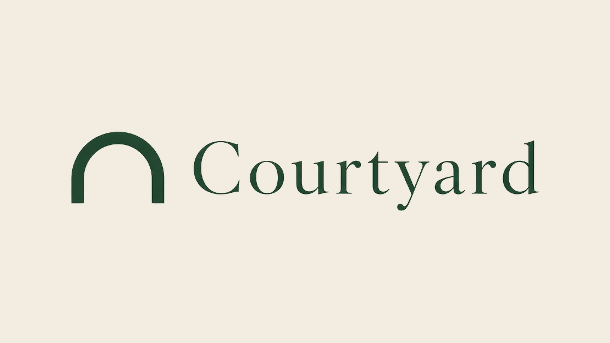
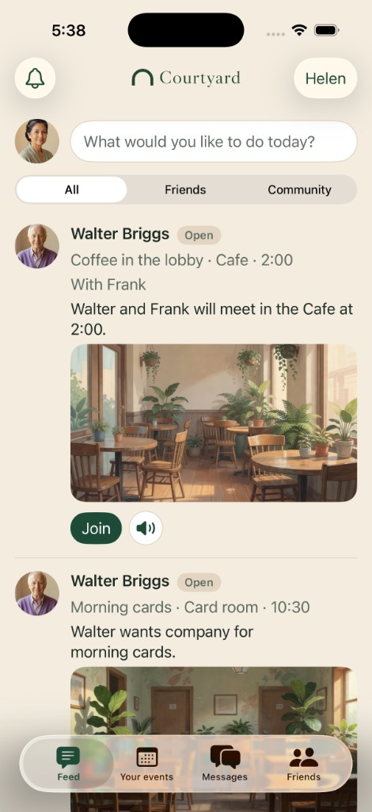
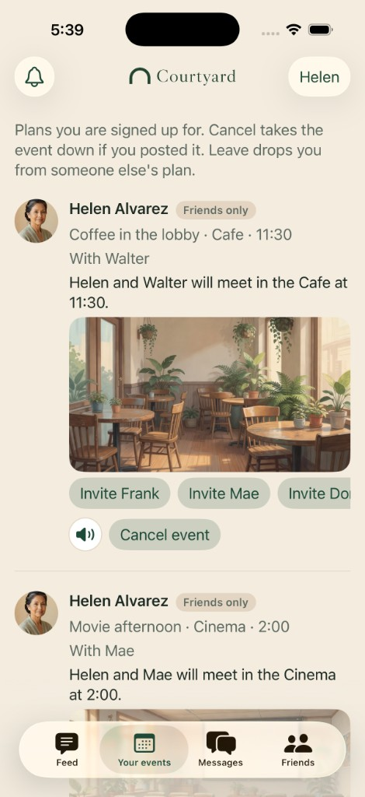
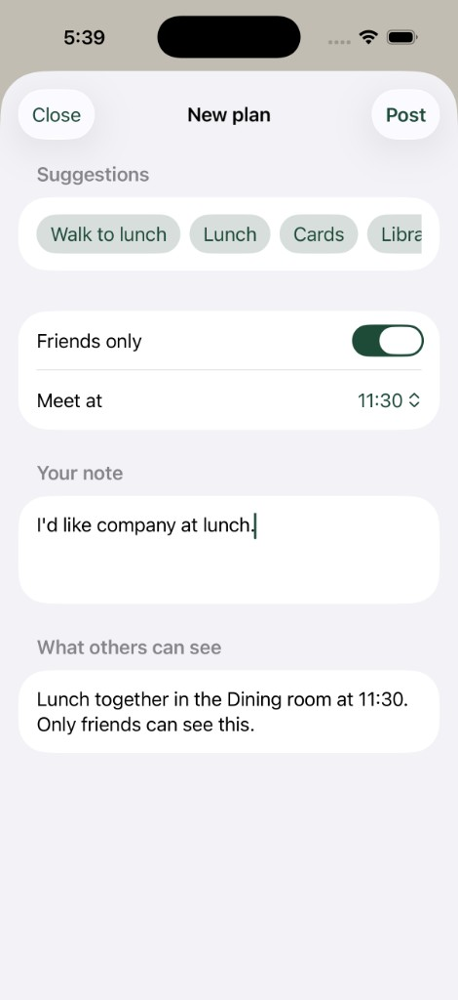
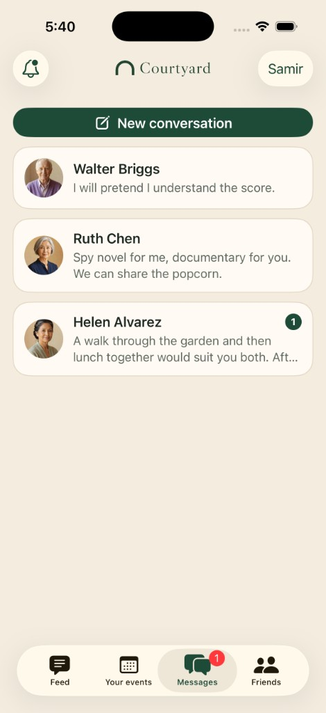
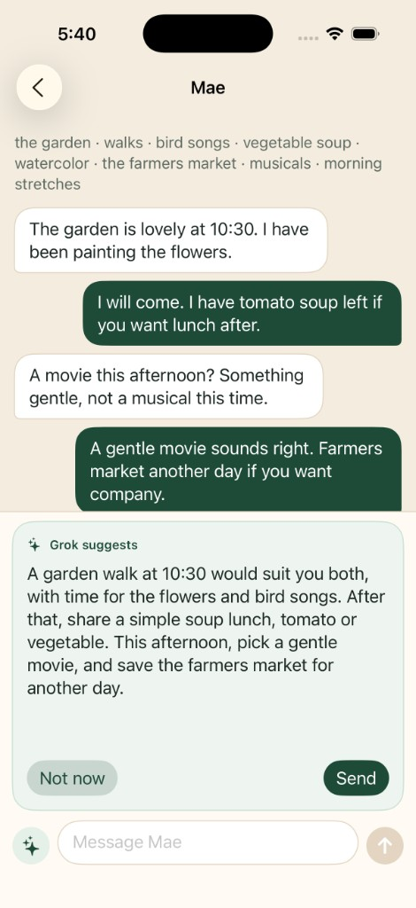
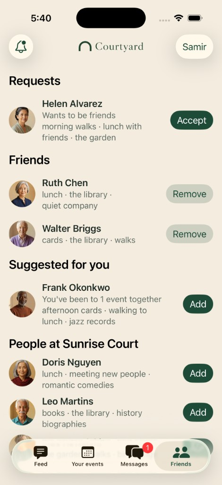

# Courtyard

Neighbors in a retirement community make everyday plans together. Private details stay off the board.



Sunrise Court is a fictional retirement community. Residents post a walk, lunch, cards, a movie, golf, or a grocery trip. They meet in shared places. A unit number, a door code, medications, money, or “I live alone” never shows up for anyone else. A fall or a medical note goes to the front desk, not to a neighbor.

The same board runs on the website and on a native iPhone app.

## The board

The feed is plans from the community, from friends, or from both. Each card shows who posted it, whether it is friends-only or open, and a painting of the place once a second person has joined. The speaker button plays that plan out loud.



Your events is everything you joined. The host can cancel. A guest can leave. Either can invite a friend. A bell collects invites, joins, leaves, and cancellations.



## A plan in their own words

Suggestions are still there: a walk to lunch, cards, the library, the garden. A resident can also write their own plan, like a carpool to the grocery store or golf. Friends only is the default. The preview shows the public card before it is posted. The unit stays off that card.



## Messages

Tap a portrait to open a conversation. Joining, leaving, or canceling a plan also leaves a line in that chat.



Inside a conversation, the sparkles button asks Grok for an idea based on both people’s tastes and the recent chat: lunch, a movie, a book, the garden. The suggestion stays on screen until the resident taps Send or Not now. A sent suggestion is labeled so both people can see it was a draft.



## Friends

Friends are mutual. The app suggests people you have already shared a plan with, and lists everyone else at Sunrise Court.



## How it is built

A Python server is the source of truth. The website and the SwiftUI app are both clients of the same API.

Meta’s Model API runs on every note. Muse Spark classifies a known activity. Muse Voice Transcribe turns a spoken note into text.

xAI runs when people are actually together. Grok writes the spoken line and the message suggestion. Grok Imagine paints the rooms and the portraits. Grok Voice reads a grouped plan aloud. A suggestion is never posted until the resident sends it.

The safety check runs before either API. Public cards are a known activity, or a title taken locally after private details are removed. Keys stay on the server.

## Run

```bash
cp .env.example .env
python3 server.py
```

Open http://127.0.0.1:8787

The app runs without keys. Add keys to `.env` and restart the server:

- `XAI_API_KEY` from https://console.x.ai — Grok writes the spoken plan, Grok Imagine paints the room, Grok Voice reads it aloud.
- `MODEL_API_KEY` from the Meta Model API dashboard — Muse Spark classifies the activity, Muse Voice Transcribe hears spoken notes.

Use fictional notes in the demo. Meta's discounted contributor models are not used, because those can train on prompts.
